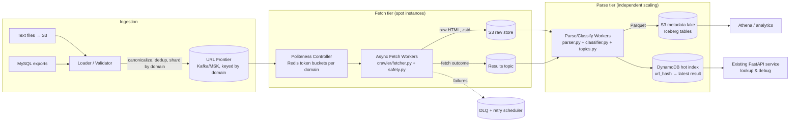

# Design: Operationalizing Collection of Billions of URLs

**Part 2 of the crawler take-home.** This document designs the system that scales
the [existing code](../crawler/) — fetcher, parser, classifier, topic extractor,
currently deployed as a single container on AWS App Runner — into a pipeline that
collects and processes **billions of URLs per month**, delivered as text files
and/or MySQL tables (e.g., all URLs for amazon.com, walmart.com, bestbuy.com for
July).

Where this document cites observed behavior (bot walls, page sizes, block rates),
it comes from operating the deployed service — not from assumptions.

---

## 1. Requirements and the numbers that shape the design

### Workload
- **Input**: monthly batches of URLs — text files and/or MySQL, partitioned by
  domain and month. Assume 1–3 billion URLs/month, heavily concentrated on a
  small number of large retail domains.
- **Output**: per URL — HTML metadata, page-type classification, ranked topics
  (exactly what `crawler/pipeline.py` produces today), plus stored raw content.
- **Mode**: batch/continuous collection, not interactive serving. The existing
  App Runner API remains as a lookup/debug surface, not the ingestion path.

### Back-of-envelope math (1B URLs/month baseline)

| Quantity | Estimate | Implication |
|---|---|---|
| Sustained crawl rate | 1B / 30d ≈ **385 URLs/sec** (1,150/sec at 3B) | modest for a fleet; trivial for compute |
| Concurrent connections | 385/sec × ~1.5s avg fetch ≈ **600 in flight** | a handful of async workers, not hundreds of hosts |
| Raw HTML volume | 1B × ~150KB avg ≈ **150 TB/mo** (≈30 TB after zstd ~5:1) | storage cost dominated by raw HTML; compression is mandatory |
| Metadata volume | 1B × ~3KB ≈ **3 TB/mo** | cheap; columnar format for analytics |
| Parse CPU | 1B × ~75ms ≈ 21K CPU-hours/mo ≈ **29 sustained vCPUs** | parsing is not the bottleneck |

### The constraint that actually dominates: per-domain politeness

The input is *billions of URLs on a few domains*. A responsible crawler
rate-limits per domain. The math is unforgiving:

> 1B URLs against one domain at 100 req/s = 10⁷ seconds ≈ **115 days**.

No amount of horizontal scaling fixes this — the limit is what the target
domain will tolerate, not what we can spin up. Every serious decision below
(frontier design, per-domain token buckets, SLO definitions, the
fetch-strategy tiers in §7) follows from this. It also means the *monthly
completion SLO must be negotiated per domain* alongside acquisition strategy
(§7): for the named retail targets, official product APIs and data licensing
can beat scraping on cost, reliability, and legality simultaneously.

---

## 2. Architecture



### Component decisions and why

**Ingestion / Loader** — text files land in S3; MySQL via monthly `SELECT ...
INTO OUTFILE` export or DMS if the table is live. The loader canonicalizes
URLs (lowercase host, strip fragments/tracking params), computes
`url_hash = sha256(canonical_url)`, dedups within the batch via the hash, and
writes to the frontier keyed by domain. Dedup matters: real URL dumps run
10–30% duplicates, and every duplicate avoided is a fetch not paid for.

**URL Frontier: Kafka (AWS MSK), partitioned by domain** — chosen over SQS
because per-domain ordering and backpressure are natural with partition keys,
and consumer lag is a first-class scaling/monitoring signal. SQS would be the
right choice at <100M/month (simpler, cheaper ops); noted as the PoC starting
point in Part 3.

**Politeness Controller** — Redis token buckets, one per domain
(`crawl_rate[domain]`, adjustable at runtime). Workers take a token before
fetching; no token → requeue with delay. Also caches per-domain robots.txt
(TTL 24h) and DNS resolutions. This is the component that encodes the §1
constraint, and the *only* place crawl aggressiveness is configured — one
knob, auditable.

**Fetch workers** — the existing `fetcher.py` (SSRF guard, streaming size cap,
guarded redirects, retries) refactored from `requests` to `asyncio` +
`aiohttp` so one 2-vCPU task holds thousands of concurrent connections. Runs
on ECS Fargate **Spot** (§6) — safe because the queue makes interruption
harmless: an unacked message is simply redelivered. Fetch workers do *no
parsing*; they write compressed raw HTML to S3 and emit an outcome record.

**Fetch/parse separation — the key cost decision.** Raw HTML is stored once;
parsing/classification is a separate consumer reading from S3. When the
classifier improves (it will — see the bot-wall taxonomy in §7), we reprocess
terabytes of stored HTML for compute cost only, instead of re-crawling for
weeks and re-spending the politeness budget. Reparsing 1B pages ≈ $500 of
spot compute; re-crawling 1B pages ≈ a month of elapsed time.

**Parse/classify workers** — `parser.py`, `classifier.py`, `topics.py`
unchanged in logic, wrapped as a batch consumer. Output lands twice:
- **S3 metadata lake** (Parquet, Apache Iceberg tables, partitioned by
  `domain, yyyymm`) — the analytical source of truth; Iceberg gives schema
  evolution (add a field without rewriting history) and time travel.
- **DynamoDB** keyed `url_hash` → latest result — the hot index the existing
  FastAPI service reads for O(1) lookups ("what do we know about this URL?").

**Storage layout and lifecycle**

| Data | Store | Format | Lifecycle | Monthly cost @1B |
|---|---|---|---|---|
| Raw HTML | S3 | zstd, partitioned `domain/yyyymm/` | Standard 90d → Glacier IR → delete at 18mo | ~30TB → ~$700 |
| Metadata | S3 (Iceberg) | Parquet | Standard, kept indefinitely | ~1TB compressed → ~$25 |
| Hot index | DynamoDB | JSON doc | latest-only upsert | ~$300 (on-demand writes) |
| Frontier | MSK | — | 7-day retention | ~$600 (3 brokers) |

---

## 3. Unified data schema

One record per crawl attempt, versioned, same shape everywhere (Kafka message
→ Parquet row → DynamoDB item). This is the contract between every component.

```jsonc
{
  "schema_version": "1.0",
  "url_hash": "sha256 of canonical_url",        // primary key
  "canonical_url": "https://www.amazon.com/dp/B009GQ034C",
  "original_url": "http://www.amazon.com/...?ref=sr_1_1",
  "domain": "amazon.com",
  "batch_id": "2026-07",                         // yyyymm partition
  "crawl_ts": "2026-07-12T04:15:00Z",

  "fetch": {
    "outcome": "ok | http_error | timeout | dns_failure | ssrf_blocked | too_many_redirects | non_html",
    "status_code": 200,
    "final_url": "...",                          // post-redirect
    "elapsed_ms": 470,
    "bytes_downloaded": 524288,
    "truncated": false,
    "content_ref": "s3://raw/amazon.com/2026-07/ab/cd/<url_hash>.html.zst",
    "attempt": 1
  },

  "page": {                                      // null unless outcome == ok
    "title": "...", "description": "...", "language": "en",
    "author": "...", "published_date": "...",
    "canonical_url_declared": "...",
    "open_graph": {}, "json_ld_types": ["Product"],
    "headings": {"h1": [], "h2": [], "h3": []},
    "word_count": 695, "link_count": 366, "image_count": 5
  },

  "classification": {
    "page_type": "product",                      // enum incl. bot_challenge
    "confidence": 0.83,
    "signals": ["json-ld @type=Product -> product (+5.0)"],
    "classifier_version": "1.2.0"                // enables selective reprocessing
  },
  "topics": [{"topic": "cuisinart toaster", "score": 25.3}],

  "quality": {
    "bot_challenged": false,
    "parse_errors": []
  }
}
```

Schema governance: JSON Schema in the repo, enforced at the producer;
`schema_version` + Iceberg evolution for additive changes; breaking changes
require a new major version and a reprocessing decision. `classifier_version`
is stored per record precisely so "reparse everything classified before v1.2"
is a cheap Athena query, not archaeology.

**Error taxonomy is data, not noise**: `ssrf_blocked`, `bot_challenge`, and
`truncated` are first-class fields because at billions of URLs the *failure
distribution* is a primary product — it tells you which domains need an API
agreement instead of a crawler (§7).

---

## 4. SLOs and SLAs

SLO = internal objective with an error budget. SLA = external contractual
commitment (set looser than the SLO so the buffer absorbs bad weeks).

| Dimension | SLO (internal) | SLA (external) |
|---|---|---|
| Batch completion | 99% of monthly batch attempted within 25 days | monthly dataset delivered by day 30 |
| Fetch success rate | ≥ 85% `ok` of attemptable URLs, per domain¹ | ≥ 80% overall |
| Data completeness | ≥ 99.9% of `ok` fetches have full metadata + classification | 99.5% |
| Pipeline freshness | p95 URL dequeued→queryable < 15 min | < 1 hour |
| Data durability | 99.999999999% (S3) | 99.999999% |
| Lookup API availability | 99.9% monthly | 99.5% |
| Lookup API latency | p95 < 100ms (DynamoDB path) | p95 < 500ms |

¹ *Attemptable* excludes URLs whose domain hard-blocks data-center IPs —
measured live: Reddit returns unconditional 403s to AWS-origin requests. The
SLO would otherwise be gamed by factors we don't control; instead,
`bot_challenge`/403 rates are reported per domain and drive the acquisition
strategy (§7), and the SLA defines these as excludable with documentation.

Error budget policy: burning >50% of a monthly budget in a week freezes
feature work in favor of reliability work — standard SRE practice, cheap to
adopt from day one.

---

## 5. Monitoring

**Stack**: Prometheus + Grafana (metrics), CloudWatch Logs → OpenSearch
(structured JSON logs), OpenTelemetry traces sampled at 0.1% (fleet) / 100%
(errors), PagerDuty (alerting). Managed equivalents (AMP/AMG) to stay lean.

**The four dashboards, in the order an operator asks questions:**

1. **Is the batch on track?** — frontier depth & consumer lag per domain,
   URLs/sec vs. plan, projected completion date per domain (the single most
   important derived metric), DLQ size.
2. **Is what we're fetching healthy?** — outcome distribution
   (ok/4xx/5xx/timeout/blocked) per domain, `bot_challenge` rate per domain,
   truncation rate, p50/p95/p99 fetch latency, bytes/page drift.
3. **Is the data good?** — field completeness (% records with
   title/description), classification confidence histogram *per domain* with
   drift alerting (a distribution shift = site redesign or new bot wall —
   detected within hours, not at month-end review), parse error rate,
   schema-violation count (should be pinned at zero), canary set: 500 known
   URLs re-crawled daily and diffed against expected metadata.
4. **What does it cost?** — $ per 1K URLs (target: see §6), spot interruption
   rate, S3/MSK/compute breakdown, forecast vs. AWS Budget (already live on
   this account).

**Paging alerts** (symptoms, not causes): projected batch completion slips >3
days; domain success rate drops >20% in 1h; DLQ growth sustained 15 min;
pipeline freshness p95 >1h; schema violations >0; monthly cost forecast >120%
of plan. Everything else is a ticket, not a page.

---

## 6. Cost model and optimization levers

Rough monthly estimate at 1B URLs (us-east-1, on-demand→spot pricing):

| Item | Estimate |
|---|---|
| Fetch fleet (Fargate Spot, ~30 × 2vCPU sustained) | ~$900 |
| Parse fleet (spot, 29 sustained vCPU equiv.) | ~$500 |
| MSK (3 × kafka.m5.large) | ~$600 |
| Redis (politeness) | ~$100 |
| S3 (raw 30TB compressed + metadata + requests) | ~$1,000 |
| DynamoDB (1B on-demand writes) | ~$1,250 |
| NAT / egress / observability | ~$650 |
| **Total** | **~$5,000/mo ≈ $5 per million URLs** |

Levers, in order of leverage:
1. **Don't fetch** — batch dedup, recrawl policy with conditional GET
   (`If-Modified-Since`/ETag) for repeat months, per-domain change-rate
   modeling (product pages churn; policy pages don't).
2. **Don't re-fetch to re-process** — the fetch/parse split (§2).
3. **Spot everything stateless** — 60–70% off compute; queue-driven workers
   are natively interruption-tolerant.
4. **Compression + lifecycle** — zstd (~5:1 on HTML) and Glacier tiering
   turn the dominant storage line item into a rounding error.
5. **DynamoDB is optional** — if no low-latency lookup consumer exists yet,
   drop it and serve from Athena; saves ~25% of total.
6. Graviton (arm64) workers: ~20% off compute; our image is pure Python — a
   one-line base-image change.

---

## 7. The bot-wall problem (measured, not hypothetical)

Operating the deployed service produced hard data:

| Site | From residential IP | From AWS IP |
|---|---|---|
| CNN | full content | full content |
| Amazon | interstitial page (200) | interstitial page (200) |
| Reddit | challenge page (200) | **hard 403** |
| REI (Akamai) | TLS-level connection drop | TLS-level connection drop |

The named targets (amazon.com, walmart.com, bestbuy.com) are the most heavily
defended sites on the internet. A design that pretends `aiohttp` + polite
rates will yield 85% success on them is fiction. Tiered strategy, cheapest
first:

- **Tier 0 — licensed/official data**: Amazon SP-API, retailer affiliate
  feeds, commercial datasets. Highest reliability, lowest legal risk, often
  cheaper than infrastructure at this scale. *Recommended primary path for
  the named retail domains.*
- **Tier 1 — plain fleet fetch** (this design): works for the long tail of
  sites, measured per-domain via `bot_challenge`/403 rates.
- **Tier 2 — headless browser fleet** (Playwright pods): executes JS
  challenges; 10–50× compute cost per page; reserve for high-value domains
  that soft-block.
- **Tier 3 — commercial proxy/unblocking services**: $1–15 per 1K pages;
  makes per-URL economics explicit; procurement + ToS review required.

Routing between tiers is a per-domain policy table driven by dashboard #2
data, reviewed weekly. Compliance guardrails baked in regardless of tier:
robots.txt honored by default, per-domain rate ceilings, identifiable
User-Agent with contact info for Tier 1, and legal review of ToS for any
Tier 2/3 usage. **This is a product/legal decision surfaced by engineering
data — the design's job is to measure and expose it, not to quietly bypass
defenses.**

---

## 8. Reliability design

- **Idempotency**: `(url_hash, batch_id)` is the unit of work; redelivered
  messages overwrite their own prior output (S3 put + DynamoDB upsert are
  idempotent) — safe retries everywhere, no distributed transactions.
- **Retries**: transient failures (5xx/timeout/connection) retry ×3 with
  exponential backoff *in code today*; then → DLQ with full error context;
  DLQ redriven on schedule after triage.
- **Blast-radius isolation**: per-domain partitions mean one hostile/broken
  domain saturates its own partition only; politeness controller can zero a
  domain's rate instantly (kill switch).
- **Checkpointing**: Kafka consumer offsets = free progress checkpointing;
  a worker crash loses only in-flight items, redelivered automatically.
- **Multi-AZ** for MSK/Redis/workers; the batch workload tolerates an AZ
  loss as throughput dip, not data loss. Multi-region is *not* justified for
  a batch pipeline — documented as an accepted trade-off.
- **Graceful degradation**: bot walls and truncations are flagged data, not
  failures (already true in the code: `bot_challenged`, `truncated` fields).
- **Runbooks + game days**: every paging alert links to a runbook; quarterly
  chaos drill (kill workers mid-batch, drop a Redis node) validates the
  recovery story before production does.

---

## 9. Next steps

Sequenced engineering plan, estimates, PoC evaluation criteria, and release
plan: see [POC_PLAN.md](POC_PLAN.md) (Part 3).
